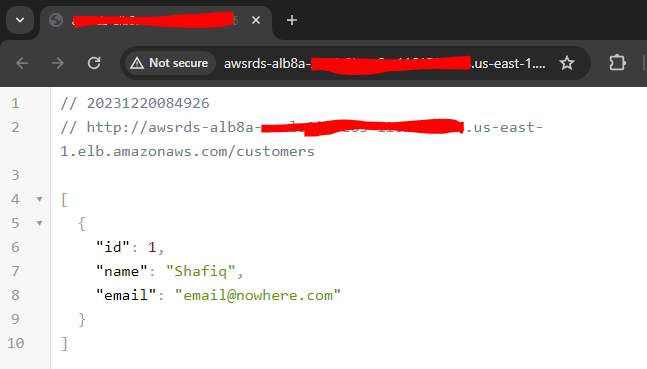

# An example of encryption in transit to AWS RDS Oracle database Using Oracle Native Network Encryption (NNE) from Spring Boot application using AWS CDK

This example demonstrates how encrypted network connections can be made from a Spring Boot application to AWS RDS Oracle database using JDBC.  Though AWS supports both Oracle NNE and TLS/SSL, this example uses Oracle NNE.

This project is deployed using AWS CDK in TypeScript.

## What does it build?
* Creates a VPC with Private Endpoints for Database.  This is required to route database traffic within AWS network.
* Creates an AWS RDS Oracle Database with NNE enabled
* Creates a Spring Boot application that connects to that Database
* Dockerizes the application
* Deployes the containerized application to ECS Cluster
* Exposes the API endpoints using AWS ALB

## Steps to run and test
* Deploy the CDK code. Wait for the deploy to finish.  It will print out the Alb endpoint for you to hit.
  * 

## NNE Considerations
* Details about Oracle NNE. [See AWS Docs](https://docs.aws.amazon.com/AmazonRDS/latest/UserGuide/Oracle.Concepts.NNE.html).
* You must upgrade JDBC Driver to latest 23 version for NNE to disable weak Cryptos.  Disabling weak cryptos provideds better security.  Ity also is not backwards compatible. [See Oracle Docs](https://docs.oracle.com/en/database/oracle/oracle-database/19/jajdb/oracle/jdbc/OracleConnection.html#CONNECTION_PROPERTY_THIN_NET_ALLOW_WEAK_CRYPTO)
* You can find the NNE configuration properties on Oracle's documentation.  [Oracle NNE Properties](https://docs.oracle.com/en/database/oracle/oracle-database/19/dbseg/configuring-network-data-encryption-and-integrity.html#GUID-7F12066A-2BA1-476C-809B-BB95A3F727CF)
* Setting the JDBC connect parameters to encryption required and matched types will enforce the client to use encrypted connection.  Please review the Spring Boot Configurations included in this project.
* All connections from the service to the database is using Private Endpoints to keep network connection within AWS network.